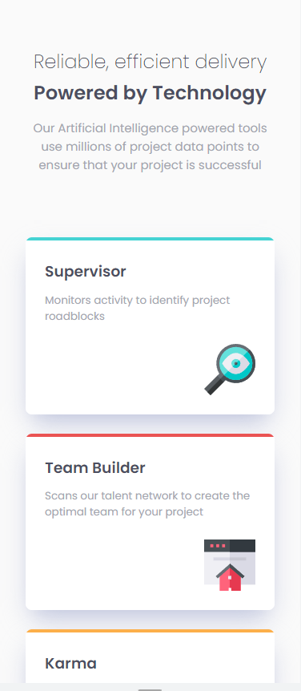
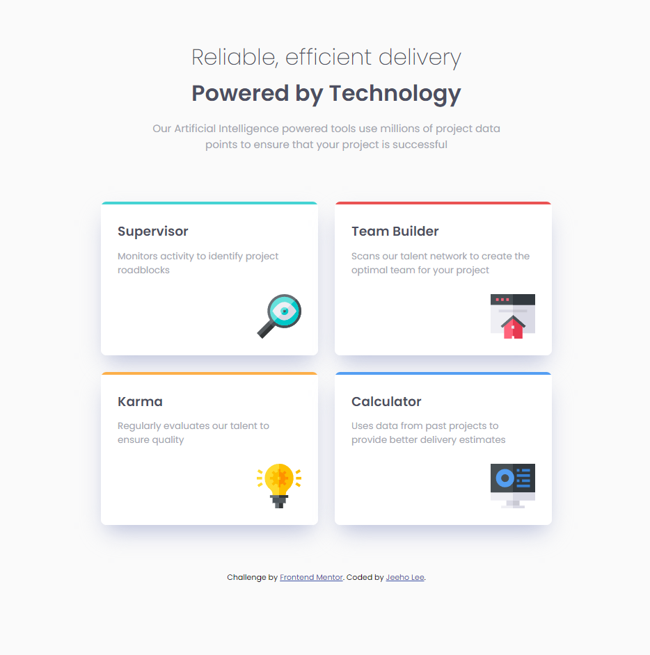
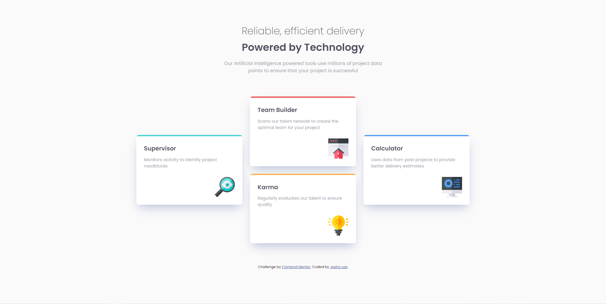

# Frontend Mentor - Four card feature section solution

This is a solution to the [Four card feature section challenge on Frontend Mentor](https://www.frontendmentor.io/challenges/four-card-feature-section-weK1eFYK). Frontend Mentor challenges help you improve your coding skills by building realistic projects. 

## Table of contents

- [Overview](#overview)
  - [The challenge](#the-challenge)
  - [Screenshot](#screenshot)
  - [Links](#links)
- [My process](#my-process)
  - [Built with](#built-with)
  - [What I learned](#what-i-learned)
  - [Continued development](#continued-development)
- [Author](#author)

**Note: Delete this note and update the table of contents based on what sections you keep.**

## Overview

### The challenge

Users should be able to:

- View the optimal layout for the site depending on their device's screen size

### Screenshot

### Links

- Solution URL: [https://github.com/jeeheezy/FEM-Four-Card-Feature-Section](https://github.com/jeeheezy/FEM-Four-Card-Feature-Section)
- Live Site URL: [https://jeeheezy.github.io/FEM-Four-Card-Feature-Section/](https://jeeheezy.github.io/FEM-Four-Card-Feature-Section/)

## My process

### Built with

- Semantic HTML5 markup
- CSS custom properties
- Flexbox
- CSS Grid
- Mobile-first workflow

### What I learned

It was my first time dealing with a single side border stylization. I was a bit confused since the border-radius curved the ends of the styled and colored border as well, so the simplest way of avoiding this issue I could find was creating a separate div over the cards to add the border-radius.

### Continued development

I still haven't had too much experience with CSS Grid, so I'd like to get a bit more experience with using the layouts.

## Author

- LinkedIn - [Jeeho Lee](https://www.linkedin.com/in/jeeho-lee-719852182/)
- Frontend Mentor - [@jeeheezy](https://www.frontendmentor.io/profile/jeeheezy)

